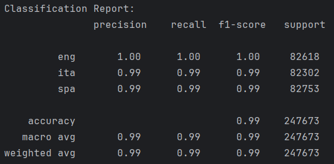

## Life Expectancy Prediction
This repository contains a [Jupyter](https://jupyter.org/) Notebook With the means to run a machine learning script to predict the language of a sentence using bayesian classification

**Data**
the data was recieved from [tatoeba](https://tatoeba.org/) which gives a data set containing the following columns:
- **ID:** this column has the ID for the current export
- **entryID:** this column has the ID from the full tatoeba database
- **Lang:** this column has 3-letter codes for the language (Eng, Spa, etc.)
- **Text:** this column contains the text that is being tested

The data is taken in using pandas and stored in a variable, the minimum size of the lists is taken in and all lists are shrunk to the minimum to ensure balanced learning

**Pre-Processing**

- drop column 0
- Name Columns
- Make text data lowercase
- Shuffle Data

the data is then split into training and test data with an 80/20 split

**Bayesian Classification**

the data on each row is split up into chunks of 2 to 3 characters for the classification

The Data is then fit to the model and the accuracy is evaluated:

The model is very over fit to the training data, but works most of the time.